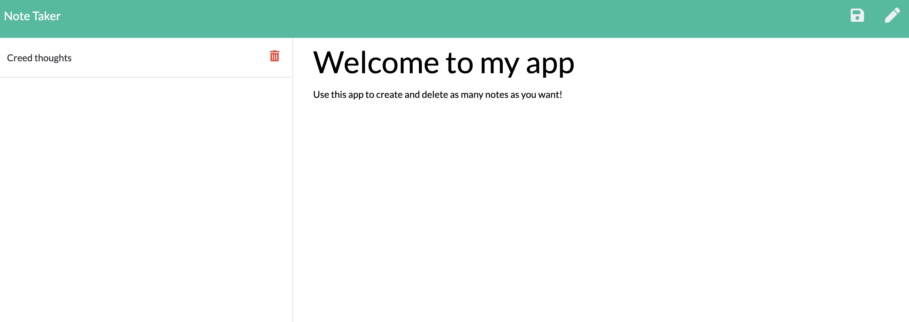

# NoteTaker
This app is meant to make writing and saving a quick note that much easier. 
It saves your notes on the page until you choose to delete them. 
It runs on ExpressJS, so make sure all dependencies are installed before using this app. 
Once everything is set up, go to localhost:8080 to see your notes!

[Note Taker App](https://note-taker1312.herokuapp.com/)

